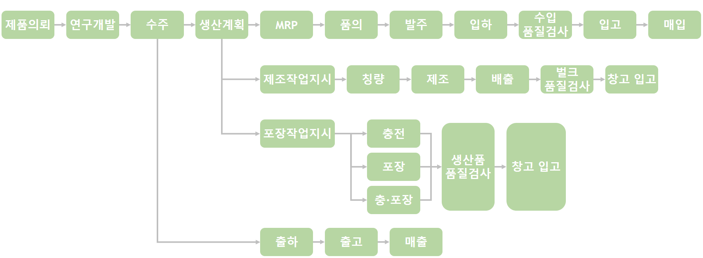
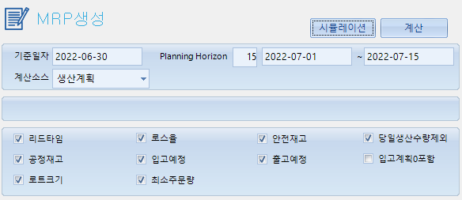

# CEP(Cosmtics Enterpirse Platform)
#### 화장품 통합관리 플랫폼
--- 
- ### OEM / ODM / OGM에 특화된 ERP, MES, POP, WMS를 통합하여 연구부터 생산까지 자동화된 전사적 업무 운영이 가능한 통합 플랫몸
- ### 전제 기능 : 연구 / 품질 / 생산 / MRP / 구매 / 영업 / 입출고 / 재고 / 외주 / 원가 / 경영자정보
::: tip
### OEM/ODM/OGM은 제조업체의 구분으로
- ####  Original Equipment Manufacture / Development / Global)
- ####  OEM: 제품 생산만 하는 업체
- ####  ODM: 제품 기획부터 제품 설계, 제품 생산까지 모두 하는 업체를 말하며
- ####  OGM: 글로벌 업체를 의미합니다.

::: 

# 화장품 제조 프로세스
- ## 제품 의뢰
--- 
#### 화장품을 만드는데 있어 가정 먼저 진행되는 일은 제품 의뢰입니다
#### 화장품을 만들고 싶은 어떠한 거래처에서 신규 제품을 만들고 싶어 화장품제조업체에 제조 의뢰를 맡긴다고 가정해 보겠습니다.
#### "색은 흰색, 제형은 로션제, 미백효과가 있는 화장품을 만들어주세요"라고 화장품제조업체에 제품 의뢰를 맡기면 [개발 의뢰](#개발-의뢰)

- ## 개발 의뢰
---
#### 화장품 제조 업체는 거래처에서 온 컨셉으로 연구개발팀에게 개발 외뢰를 합니다.

- ## 연구 개발
---
#### 연구개발팀에서는 전달받은 컨셉으로 벌크를 개발하게 됩니다.
 

#### 개발과정에서 진행되는 주 업무들은 연구개발에 대한 기록을 하는 [연구개발노트](#연구개발노트) 작성과
#### 확정된 연구에 대해 어떠한 공정으 흐름으로 제조를 할지 설정하는 [공정흐름설정](#공정흐름설정),
#### 해당 벌크에 어떠한 원료들이 들어 갔는지 등록하는 [품목별원료등록](#품목별원료등록)을 진행합니다.
#### 그리고 연구개발이 끝나고 나중에 제조를 들어가기 전 [처방확정](#처방확정)을 진행합니다.

- ## 수주
---
#### 거래처에서 요청한 제품이 개발이 완료되면 거래처에 샘플을 전달합니다.
#### 거래처는 샘플을 확인한 후 해당 제품을 test해보고 문제가 발생하거나 마음에 들지 않으면
#### 다시 수정사항을 보내고 적합성 테스트후 문제가 없으면 다시 거래처에 보내고 이 과정을 계속 반복하다가
#### 거래처가 샘플을 확인후 컨셉과 맞다고 생각하면 발주를 넣게 됩니다. 그 발주는 넣는게 "수주"입니다

- ## 제조
---
### 수주를 받은 화장품 제조업체는 생산계획을 세워 벌크 제조 및 포장 작업, 기한에 맞게 납품까지 하게 됩니다.

#### 전체프로세스
 
 

# CEP 프로세스
## 연구개발
---

#### 연구개발 프로세스

## 연구개발노트💻
#### 연구개발관리 > 연구개발노트
---
#### 연구개발은 벌크를 만들 때 어떤 원료를 넣을지, 해당 원료를 얼마나 넣을지, 총 비율은 어떻게 할지 등
#### 개발하고자 하는 벌크를 어떻게 만들지 연구하고 개발하는 화면입니다.

 

#### 이런 연구 개발 과정에서 나오는 실험들을 기록하는 관리 하는 것이 연구개발노트 입니다.
#### 시험 과정에서 들어간 원료는 어떤 것인지, 해당 원료는 얼마나 들어갔는지 기록합니다.
::: danger
 주의할 점은 각 원료들의 총 함량을 100%로 맞추어야 합니다 
::: 

#### 연구개발노트에는 여러 개의 실험을 등록할 수 있는데 그 중 실제로 벌크 제작에 사용될 비율의 실험 확정 처리를 해줍니다.
#### 확정 처리를 해주면 해당 시험으로 처방 등록을 할 수 있게 됩니다.

## 처방등록💻
#### 연구개발관리 > 처방등록관리 > 처방등록
---
#### 연구개발노트 작성이 끝나면 품목별원료정보등록을 합니다
#### 실제 품목에 연구개발로 확정된 처방을 등록하여 해당 품목이 벌크의 BOM을 구성할 수 있도록 합니다.

#### 시제품 처방불러오기를 통해 연구개발노트에서 확정 해놓은 처방을 불러올 수도 있습니다.
 

#### 원료 정보 등록이 다 되면 국가별 성분 확인을 통해 납품하고자 하는 국가에 금지 혹은 한도를 위반한 성분이 없는지 확인 합니다.
::: tip
#### 품목별원료정보등록 시 옵션에 따라 대체 처방을 등록할 수 있습니다.
 

#### 대체처방 옵션을 사용하면 제조는 대체처방 기준으로 제조하고,
#### 처방실적기록서에는 원처방을 기준으로 내역 조회 및 양식을 출력합니다.

:::

## 공정흐름설정💻
#### 연구개발관리 > 처방등록관리 > 공정흐름설정
---
#### 처방 등록까지 완료되면 해당 벌크의 공정 흐음을 설정합니다.
#### 공정 흐름 설정은 벌크를 만들 때 어떠한 순서로 제로를 진행할지, 어떠한 방법으로 제조를 진행할지는 설정하는 것입니다.

## 수주
---

#### 수주 프로세스

## 수주서💻
#### 영업관리 > 내수관리 > 수주관리 > 수주서
---
#### 수주를 등록하려면 수주서 화면에서 어떠 제품을 언제까지 얼마나 납품하겠다는 수주서를 등록합니다.

## 생산계획💻
#### 생산계획 > MPS관리 > 생산계획
---
#### 수주서를 등록하고 나면 해당 수주서에 제품을 어떻게 생산할지 생산계획을 하게 되는데
#### 수주조회버튼을 통해 현재 진행 중인 수주서를 조회하여 생산계획을 하고자 하는 수주서를 찾아 등록버튼을 클릭하면
#### 생산계획을 설정하는 팝업이 나오게 됨니다.
 

#### 해당 팝업창에서 제품은 어떤 라인에서 얼마나 생산 할지, 충진품은 어떤라인에서 얼마나 생산할지,
#### 또 벌크는 얼마나 생산할지 등을 설정할 수 있고 생산계획을 설정하고 저장하면 해당 생산 계획이 포함된 MRP를 돌릴 수 있게 됩니다.

## MRP💻
#### 생산계획관리 > MRP관리 > MRP생성
---
#### MRP는 Material Resources Planning으로 자재소유계획을 의미합니다.
#### 쉽게 말해서 현재 가지고 있는 자재 수량이 얼마인지 파악해서 주문해야하는 량이 얼마인지, 언제까지 주문을 해야하는지 계산하는 것입니다.
#### 이런 MRP를 계산하는데 있어서 보이는 보이는 것과 같이 다양한 옵션이있습니다.
#### 사용할 옵션을 선택하여 계산버튼을 클릭해주면 됩니다.
 
::: tip
- #### 리드타임: 주문을 했을 때부터 도착을 할 때까지 걸리는 시간
- #### 로스율: 공정과정에서 날아가는 량
- #### 안전재고: (갑작스러운 주문을 대비해서) 항시 보유하고 있어야하는 재고량
- #### 공정재고: 작업장에는 가 있지만 사용되지 않고 돌아올 재고
- #### 로트크기: 원료의 한덩어리, 한묶음 단위 크기 입니다

:::

## 품의💻
#### 생산계획관리 > MRP관리 > 예상구매발주내역2
---
#### MRP를 통해 계산된 내용은 예상구매발주내역 화면에서 확인할 수 있고
#### 구매를 진행해야하는 품목을 선택하여 품의를 올리게 됩니다.
::: tip
#### 품의: 발주전 상위 결재권자에게 먼저 확인을 하는 작업
:::
## 발주💻
#### 구매관리 > 구매발주관리 > 구매발주서
---
#### 구매발주서화면에서 품의를 올린 내역들을 미처리품의내역을 통해 불러올 수 있고,
#### 불러온 품의 내역 중 발주를 하고자 하는 품목을 선택해 저장하여 시스템 상 발주 처리가 되도록 합니다.
#### 추가로 실제로 발주가 일어나야 하기 때문에 메일 발송을 통해 거래처에 실제 발주 메일이 전달되도록 합니다.

## 입하💻
#### 구매관리 > 입고관리 > 입하관리 > 입하처리
---
#### 발주가 완료되고 발주한 품목이 창고에 도착하게 되면 바로 창고로 입고하는 것이 아니라
#### 품목이 문제없이 들어왔는지 확인하는 품질검사를 해야합니다.
#### 품질검사 하기 전 품목이 도착했다는 것을 의미하는 입하처리를 우선적으로 하게 됩니다.
#### 발주는 되었지만 아직 입하 처리가 되지 않은 내역을 확인하는 “미입하내역” 버튼을 클릭하여 발주 품목을 조회해 옵니다.
#### 품명과 수량 등 입하 정보를 확인하고 저장 합니다.

## 수입품질검사💻
#### 품질관리 > 수입검사 > 원료검사, 부자재검사
---
#### 입하처리가 완료된 품목은 품질검사를 진행하게 됩니다.
#### "미검사내역" 버튼을 클릭하면 입하 처리된 품목 중 품질검사를 진행하지 않으 품목리스트가 나오는데
#### 해당 품목을 가지고 와 검사 결가 입력하고 저장합니다,

## 입고💻
#### 구매관리 > 입고관리 > 입고관리 > 입고처리
---
#### 품질 검사까지 끝난 품목은 입고 처리를 해야하기 때문에 입고처리화면에서 
#### 어떤 창고에 입고할지 창고를 지정하고, "미입고내역"버튼을 클릭하여 입고처리를 할 품목을 찾아 저장해 줍니다.

## 매입💻
#### 구매관리 > 매입처리 > 매입처리
---
#### 입고처리까지 다 된 품목은 매입처리를 할 수 있게 됩니다.
#### 매입처리 탭에서 "미처리내역"버튼을 클릭하여 입고된 항목을 가져와
#### 매입정보 확인 후 저장 하여 매입저장을 해줍니다.
::: tip
#### 보통 주기를 정해서 그 주기마다 한번씩 매입처리를 해준다.
:::

## 벌크 제조
---

## 생산계획💻
#### 생산계획관리 > MPS관리 > 생산계획
---
#### 제조작업을 진행하기 위해서는 제조작업지시를 내려야 합니다.
#### 생선계획을 참조하여 제조작업지시를 내리기 위해서는 이전 설정해둔 [생산계획](#수주서를-등록하고-나면-해당-수주서에-제품을-어떻게-생산할지-생산계획을-하게-되는데)에서 제조파트의 생산계획을 확정으로 변환하여야 합니다

## 제조작업지시💻
#### 공정관리 > 작업지시관리 > 제조작업지시서
---
#### 생산계획을 확정으로 돌리면 제조작업지시 창에서 생산계획을 참조하여 제조작업지시를 내릴 수 있게 됩니다.

## 처방 확정💻
#### 연구개발관리 > 처방관리 > 처방확정
---
#### 처방 확정은 제조작업지시가 내려지고 나면 칭량하기 전 해당 처방으로 제조를 진행하면 되는지 승인 받는 과정입니다.
#### 옵션에 따라 자동 승인 처리를 할 수도 있브니다.
#### 자동승인 옵션을 사용하지 않는다면 연구개발팀에서 승인 처리를 통해 해당 원료로, 기입된 함량으로 제조를 하겠다고
#### 승인해 주어야 다음 과정이 가능합니다.

# 원료등록
--- 
### menu: 원료등록
#### 1. 원료 선택하고 밑에 성분 추가하고 저장

 
 

# 품목등록
--- 
### menu: 기초정보 -> 품목정보 -> 품목정보등록
#### 여기서 1~6번까지 모든 정보를 추가 할 수 있다 (벌크에 성분 넣는거는 연구개발노트에서)
#### 1. 어떤 품목 넣은 건지 선택 고객사 품목유형 작성후 저장(품목구분, 고객사, 품목유형, 품목명칭)필수 입력 값
::: tip
####  품목정보등록에서 로트관리 체크해야 로트번호 자동생성 ✔
#### 품목정보등록할때 품질에탭에 수입검사를 체크해야 입하처리에서 검사가 체크되어 있다. ✔
:::

 
 

# 벌크 등록 
--- 
### menu: 연구개발관리 -> 연구개발노트
#### 원료들 추가해서 벌크를 만들수 있다. 무조건 100%를 맞춰야한다
#### 1. 상단에 input들에 모두 값은 입력한다. (거래처,제품명,LAB.NO) 필수 입력 값
#### 2. 상 입력 상: 작업단위라고 생각하면 쉽다. 예를들면 계란후라이를 할때 팬을 달군다, 기름을 두른다, 계란은 넣는다 이렇듯 하나의 작업단위를 상이라고한다 (상은 보통 A,B,C)이런식으로 작성
#### 3. 원료 추가하고 비율맞춘다 합이 100퍼
#### 4. 저장하고 저장 단축키(f4) 원료명 오른쪽 컬럼을 잡고 완료-> 확정

### 연구개발관리 -> 처방등록관리- > 처방등록
#### 1. 품목선택
#### 2. 시제품처방불러오기해서 방금 만든 처방 불러오기
#### 3. 상단에 성분확인 클릭
#### 4. 원료확정 선택하고 저장

 
 

# BOM추가
--- 
### menu: 품목정보 -> 설계정보 -> DOM구성
#### 1. 품목추가 제품 추가 되면 클릭하고 라인추가
#### 2. 라우팅 설정, 단위수량(몇개가 필요한지)
#### 3. 저장
#### 4. 이런식으로 쭉 구성하면 된다

 
 

# 예외입고
--- 
#### 품목의 재고가 있어야 출고를 할 수 있기때문에 하는거
### menu: 재고관리 -> 예외입고관리 -> 예외입고요청서
#### 1. 라인추가하고 에외입고할 품목 선택 입고량 입력 저장

### 재고관리-예외입고관리-예외입고처리
#### 1. 미처리요청내역에서 입고창고(입하창고 선택) 저장

 
 

# 수주넣기
--- 
### menu: 영업관리 -> 내수관리 -> 수주관리 -> 수주서
#### 1. 품목입력 (제품으로)

 
 

# 입하처리
--- 
### menu: 생상계획관리 -> MRP관리 -> 예상구매발주내역2
#### 1. 발주단가, 단가 입력후 선택구매품의 클릭

 
 

# 발주
--- 
### menu: 구매관리 -> 구매발주관리 -> 구매발주서
#### 1. 미처리품의내역 클릭해서 품의한거 가져와서 량 정하고 저장

 
 

# 입하
--- 
### menu: 구매관리 -> 입고관리 -> 입하처리
#### 1.  수량 설정하고 저장

 
 s

# 수입검사해야함
--- 
### menu: 품질관리 -> 수입검사 -> 원료검사 
#### 1. 미검사내역에서 선텍후 판정 적합으로 바꾸고 저장

 
 

# 입고
--- 
### menu: 구매관리 -> 입고관리 -> 입고관리 -> 입고처리
#### 1. 미입고내역에서 선택후 저장

 
 

# 매입
--- 
### menu: 구매관리 -> 입고관리 -> 매입처리
#### 1. 미처리매입내역에서 선택후 저장

 
 

# 출하지시
--- 
### menu: 영업관리 -> 내수관리 -> 출하시지관리 -> 출하지시서(내수)
#### 1. 미처리 수주내역에서 선택후 입력 저장

 
 

# 출고처리 수량있어야 출고를 한다
--- 
### menu: 영업관리 -> 출고관리 -> 출고관리 -> 출고처리
#### 1. 출하지시내역클릭 저장

 
 

# 매출
---
### menu: 매출처리..

 
 

# 벌크제조
--- 
### menu: 생산계획관리 -> MPS관리 -> 생산계획
###

 
 

---
### 교육 들으면서 정리한 내용

::: details
<pre>
수주관리 
수주서
매출구분 거래유형 수량 
단가구분
진단가(진짜) 가단가(가짜)

품목기준단가등록

거래처별품목기준단가등록

납품처 나가야하는는 회사
매출처 돈 내는 회사
보통 동일함

에상구매발주내역2

구매품의

구매발주서
미처리품의내역

발주를 하고

입하처리

선택하고 선택적용
단위수량 하나 박스에 몇개들어 있는가
입화량과 입화합계가 같아야한다
덤수량 공짜재고 옵션을 설정안하면 재고로 안잡힘

품목정보등록
로트관리:선입선출하려고 쓴다
수입검사: 입고할때 검사를 하겠다 하면 입하처리에서 검사에 체크되었있음

입하처리
미입하내역에서 추가
원자재시럼중라벨

원료검사현황

사내재고현황

창고위치

수주 -> 생산계획 -> MRP -> 품의 -> 구매발주 ->입하(재고x)처리 -> 수입검사(검사체크가 o) -> 입고(재고ㅇ)
 
매입처리 보통은 한달에 한번정도 한다
미처리매입내역에서 더블클릭하면 들어간다

1.수주를 내린다.
2.예상구매발주내역2 조회 후 있는 원료 중 하나 선택 ->품의
3.발주서 작성
4.입하 처리
5.수입 검사
6.입고 처리
7.매입처리

입고반품관리
입고반품요청 입고내역
요청략 설정하고 입고반품사유 선택하고 재고반영

매입처리에서 반품으로 뜨면 양품으로 저장하고 매입처리

입고반품처리

사내재고현황

 단가등록
1. 구매기준단가등록
2. 거래처별품목기준 단가등록
3. 품목기준단가등록

원자재를 따로 구매향 할 일이 생겼을때 따로 구매품의에서 구매품의를 내릴수 있다

입하처리
입고유형에서 비계획입고도 있다(독립으로) 발주 상관없이 내릴수 있다

부자재라밸인쇄에서 인쇄가능

수주마감
제품을 만들다가 취소거나 이 수주로 더 이상 작업을 안하겠다 하면 수주마감을 하여 기록은 남기되 마감처리한다

출하지시서 화면
미처리 수주내역 클릭해서 재고 선택해서 재고반영 -> 출하지시일 입력 출고창고 확인해서 저장
무상출소: 공짜로 줄때
지시량 : 돈을 받고 준다
출하유형 독립일때는 수주와 상관없이 출고처리를 할 수 있다.

출고처리 화면
출하시지내역 클릭해서 선택후 수량이 있을때 그걸 저장하면 그 품목출하
그리고 출고한 품목의 로트 번호로 조회해서 더블 클릭하면 세부정보를 볼 수 있다.

wms를 쓰는 창고면 wms에 코드를 쳐서 

wms재고현항에서 확인가능

매출처리

고객클레임접수에서 출고내역 불려온 저장
출고반품처리에서 반품요청내역에서 불러와서

----------재고관리-------------
창고별재고초기 화면
erp시스템이 도입되지 전에 있던 재고가 몇개있고 로트 본호이런식으로 처음 재고를 입력 할 수 있는 화면

작업장재공초기 화면
 양품이 몇개 이런식으로 처음 재고를 입력 할 수 있는 화면
 
wms 재고초기화면
 품목바코드 생성하면 바코드 생심 조회는 

___예외입고

예외입고요청화면
 예외로 들어온 입고량 추가 
 수량을 넣고 입고사유 입력 하고 저장하고

예외입고처리요청
 요청에서온 입고량을 미처리요청에서 추가해서 입고량을 잡는데

wms로도 예외입고처리가능
 
___예외출고

예외출고요청서 화면
예외출고요청사유 작성하고 저장후
더블클릭하고 라벨인쇄

예외출고처리 화면
미처리요청에서 불러온 후 저장

인쇄하고 거거 있는 코드로  wms에서도 예외출고 가능

재고이동요청처리 화면
창고에서 창고로 이동할때 요청하는 화면
 이것도 라벨인쇄해서wms로 처리 할 수 있다.

출고창고 입고창고
   0            0      이동관리-창고관리 출고처리-입고처리
   0            x       출고처리
   0            x       입고처리
   0            x       cep프로그램 내에서 처리

사내재고현황 화면
내역별로 확인가능

더블클릭하면 수출현황을 볼 수 있다, 
조달구분에 따라서 자산: 돈을 주고 // 조달구분이 시급인 품목

창고정보등록 화면
불용창고에 클릭하면 사용하지 않는 창고로 들어간다

상은 작업단위처럼 한번에 일어나는 작업들을 뭐시기 한다

공정흐름설정 화면
 구성품목에 라인 추가 해서 구분 흐름을 보여주는 화면

공정재고현황 화면
  작업장 볼 수 있다잉

재고조정(실사) (재고조정은 한 품목기준 하루에 한개만 가능)화면
 예외출고 이익만 남기고 싶지 않을떄
  조정일자 입력해서 조회
(wms로 제고관리하는 창고이면 wms창고 탭에서 먼저 처리를 해야한다)

wms사용하는 창고일 경우
 wms처리(입, 출고) -> ceo재고도 함께 변동 (wms재고는 신중히해야함)
 cep처리-> cep재고만 변동

창고별재고마감 화면
 더 이상 이전으로 재고변동을 하지 않겠다.삭제 수정 불가능하다

작업장별재공재고마감 화면

소요량계산 화면
  제품 n개가 일 안에 품목이 몇가지가 들어가는지 계산 하는 화면

생산소요자재재고여력 화면
 생산제품 수량 입력조회 -> 하위 선택 후 구매 품의

품목별 통한 재고현황 화면
 모든 품목 재고현황(로트별, 창고별)

자재및
</pre>

:::
   
 
